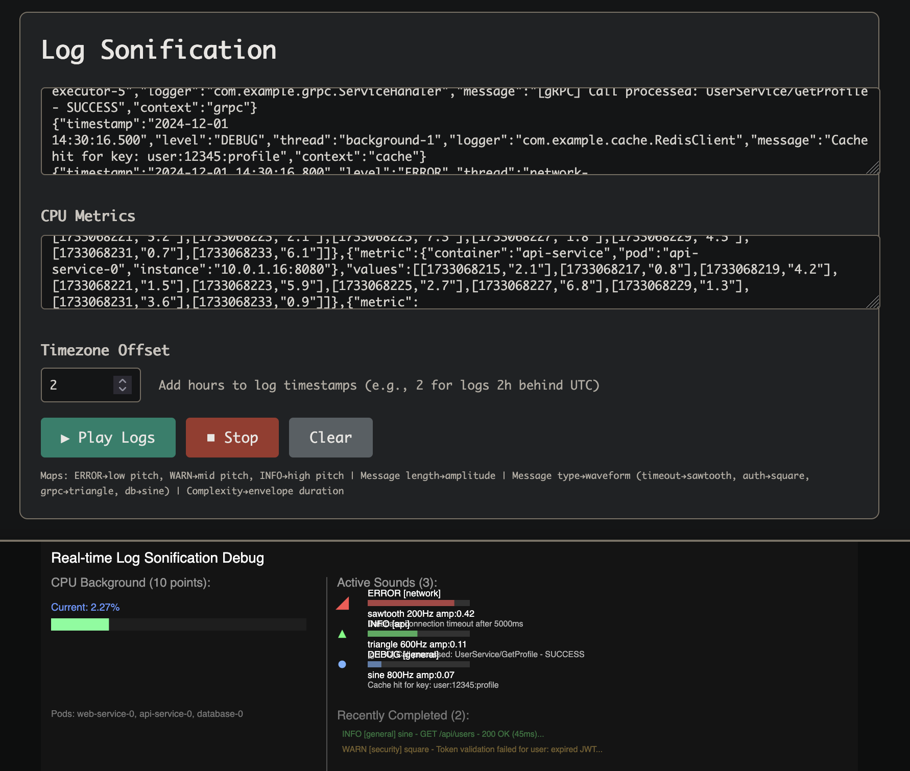

# Log Sonification Playground

A real-time audio visualization tool that transforms server logs and system metrics into immersive soundscapes using p5.js.



## Features

### 🎵 Log Sonification
- **JSON log format support** with timestamp-based scheduling
- **Acoustic fingerprinting** - different message types trigger distinct waveforms:
  - Network issues → sawtooth waves
  - Security/auth → square waves  
  - API calls → triangle waves
  - Database operations → sine waves
- **Dynamic sound properties** based on log characteristics:
  - Log level → frequency (ERROR=low, WARN=mid, INFO=high, DEBUG=highest)
  - Message complexity → envelope duration
  - Response time → amplitude
  - Message length → amplitude modulation

### 📊 System Metrics Background
- **CPU metrics integration** from Prometheus JSON format
- **Background white noise** that correlates with CPU usage percentage
- **Smooth amplitude transitions** between metric data points
- **Multi-pod averaging** for clean audio representation

### 🎛️ Real-time Visualization
- **Split-panel debug view** with CPU metrics on left, log details on right
- **Live CPU timeline** showing 1-minute sliding window with current position indicator
- **Active sound tracking** with progress bars and acoustic properties
- **Visual waveform indicators** using shapes (◆ sine, ▲ triangle, ■ square, ▼ sawtooth)

### ⚙️ Configuration
- **Timezone offset adjustment** for log timestamp synchronization
- **Hot reloading** development server for rapid iteration
- **Responsive design** for different screen sizes

## Quick Start

1. **Install dependencies**:
   ```bash
   npm install
   ```

2. **Start development server**:
   ```bash
   npm run dev
   ```

3. **Open browser** to `http://localhost:8080`

4. **Paste your data**:
   - JSON server logs in the main textarea
   - Prometheus CPU metrics in the CPU section
   - Adjust timezone offset if needed (default: +2 hours)

5. **Click Play** to start the sonification

## Data Formats

### JSON Logs
```json
{"timestamp":"2025-06-27 08:47:40.463","level":"INFO","thread":"grpc-default-executor-6","logger":"com.example.grpc.GrpcLoggingRequest","message":"[gRPC] Call received: method=com.example.grpc.ping.PingService/Ping, from=/192.168.1.100:44922","context":"default"}
```

### Prometheus CPU Metrics
```json
{"status":"success","data":{"resultType":"matrix","result":[{"metric":{"container":"app-service","pod":"app-service-0"},"values":[[1751234003,"2.44"],[1751234018,"2.48"]]}]}}
```

## Technology Stack

- **p5.js** - Creative coding framework for audio synthesis and visualization
- **p5.sound** - Web Audio API wrapper for oscillators, envelopes, and effects
- **live-server** - Hot reloading development server
- **Vanilla JS** - No additional frameworks for maximum performance

## Audio Architecture

- **Dynamic oscillator pools** - Creates new oscillators for overlapping sounds to enable natural audio interference
- **ADSR envelopes** - Configurable attack, decay, sustain, release for different message complexities
- **Frequency mapping** - Log levels mapped to distinct frequency ranges
- **Amplitude modulation** - Multiple factors influence volume (response time, message length, log level)
- **Background noise layer** - CPU metrics drive continuous white noise amplitude

## Development

The project uses hot reloading for rapid development. Changes to any file automatically refresh the browser. The access log is ignored to prevent infinite reload loops.

Built for real-time monitoring of distributed systems through immersive audio feedback.

## Live Demo

🎵 **[Try it online](https://gurghet.github.io/log-sonification-playground/)** - Paste the example data and click Play!

> 💡 Copy the contents of `example-logs.json` and `example-cpu.json` for instant demo

## Quick Local Setup

```bash
git clone https://github.com/gurghet/log-sonification-playground.git
cd log-sonification-playground
npm run dev
# Open http://localhost:8080
```

## Use Cases

- **DevOps Monitoring** - Turn server logs into ambient soundscapes for background monitoring
- **Security Operations** - Audio alerts for suspicious patterns in authentication logs  
- **Performance Analysis** - Correlate CPU spikes with log events through synchronized audio
- **Data Sonification Research** - Explore acoustic representations of temporal data
- **Creative Coding** - Generate music from system metrics and application events
- **Accessibility** - Audio feedback for visually impaired system administrators

## Related Projects

If you're interested in log sonification, you might also like:
- [Sonification Handbook](https://sonification.de/handbook/) - Academic resource on data sonification
- [tone.js](https://tonejs.github.io/) - Web Audio framework for interactive music
- [D3.js Audio](https://observablehq.com/@d3/audio) - Data-driven audio visualizations
- [WebPd](https://github.com/sebpiq/WebPd) - Pure Data in the browser for audio synthesis

## Contributing

Contributions welcome! Areas for improvement:
- Additional audio synthesis techniques (FM, granular synthesis)
- Machine learning for pattern recognition in logs  
- WebRTC streaming for collaborative monitoring sessions
- Integration with popular monitoring platforms (Grafana, Datadog)
- Mobile-responsive touch controls
- Additional metric types (memory, network, disk I/O)

## License

MIT License - Feel free to use in your own projects!